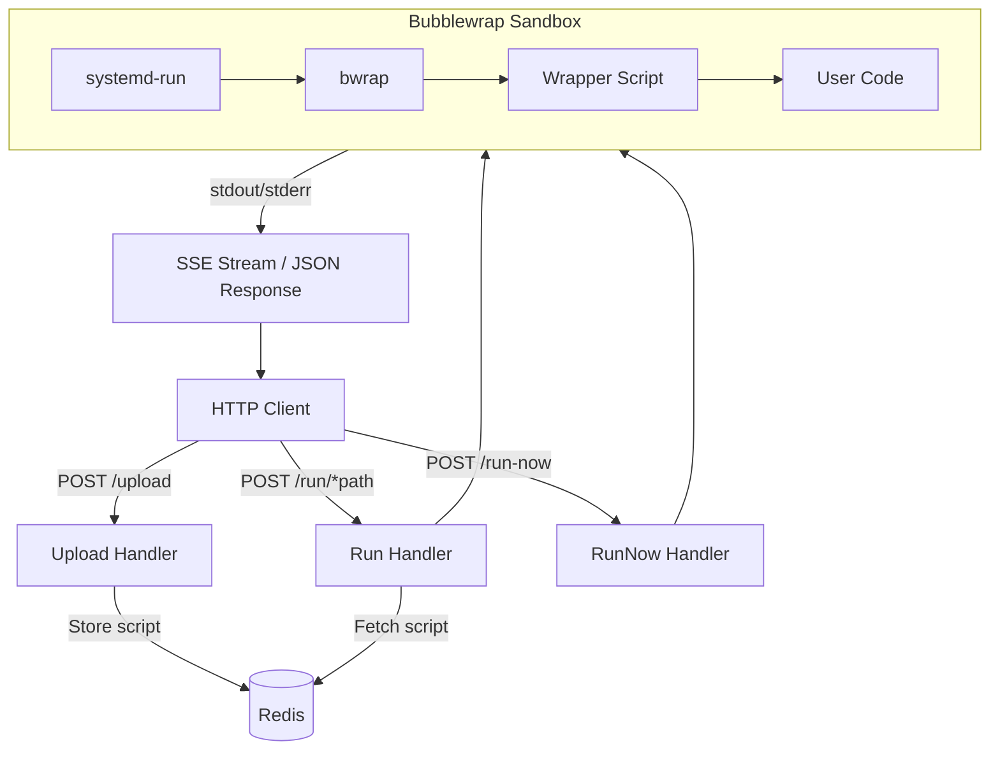

> [!NOTE]
> This README was generated by [SKILL](https://github.com/pardnchiu/skill-readme-generate), get the ZH version from [here](./doc/README.zh.md).


# go-faas

[](https://pkg.go.dev/github.com/pardnchiu/go-faas)
[](https://goreportcard.com/report/github.com/pardnchiu/go-faas)
[](LICENSE)
[](https://github.com/pardnchiu/go-faas/releases)

> A lightweight Function-as-a-Service platform that accepts code via HTTP API and executes it securely inside a Bubblewrap sandbox.

## Table of Contents

- [Features](#features)
- [Architecture](#architecture)
- [File Structure](#file-structure)
- [License](#license)
- [Author](#author)
- [Stars](#stars)

## Features

> `go install github.com/pardnchiu/go-faas/cmd/api@latest` · [Documentation](./doc/doc.md)

### Bubblewrap Sandbox Isolation

All user-submitted code runs inside a Bubblewrap sandbox with full Linux namespace isolation covering filesystem, network, and process space. Every capability is dropped, and only read-only system paths and the wrapper script are mounted, ensuring user code cannot access host resources or make outbound connections.

### Multi-Language Execution with Version Control

Accept and execute Python, JavaScript, and TypeScript code through a unified HTTP API. Scripts are versioned and stored in Redis with automatic timestamp-based versioning on each upload, allowing callers to target a specific version or always run the latest iteration.

### Systemd Slice Resource Control

Each sandbox process is launched via systemd-run under a dedicated systemd slice that enforces CPU quota and memory ceiling. When a script exceeds its resource budget, the system terminates it at the kernel level, preventing any single execution from degrading overall service stability.

## Architecture



## File Structure

```
go-faas/
├── cmd/
│   └── api/
│       └── main.go              # Entry point
├── internal/
│   ├── router.go                # HTTP route definitions
│   ├── checker/
│   │   └── checker.go           # Dependency check and auto-install
│   ├── database/
│   │   └── redis.go             # Redis script storage and versioning
│   ├── handler/
│   │   ├── run.go               # Code execution handler
│   │   ├── upload.go            # Script upload handler
│   │   └── sse.go               # SSE streaming output
│   ├── sandbox/
│   │   ├── command.go           # Bubblewrap sandbox command builder
│   │   └── slice.go             # Systemd slice resource limits
│   ├── resource/
│   │   ├── wrapper.py           # Python wrapper
│   │   ├── wrapper.js           # JavaScript wrapper
│   │   └── wrapper.ts           # TypeScript wrapper
│   └── utils/
│       └── getEnv.go            # Environment variable helpers
├── .env.example
├── go.mod
└── LICENSE
```

## License

This project is licensed under the [MIT LICENSE](LICENSE).

## Author


<h4 style="padding-top: 0">邱敬幃 Pardn Chiu</h4>

<a href="mailto:dev@pardn.io" target="_blank">

</a> <a href="https://linkedin.com/in/pardnchiu" target="_blank">

</a>

## Stars

[](https://www.star-history.com/#pardnchiu/go-faas&Date)

***

©️ 2025 [邱敬幃 Pardn Chiu](https://linkedin.com/in/pardnchiu)
