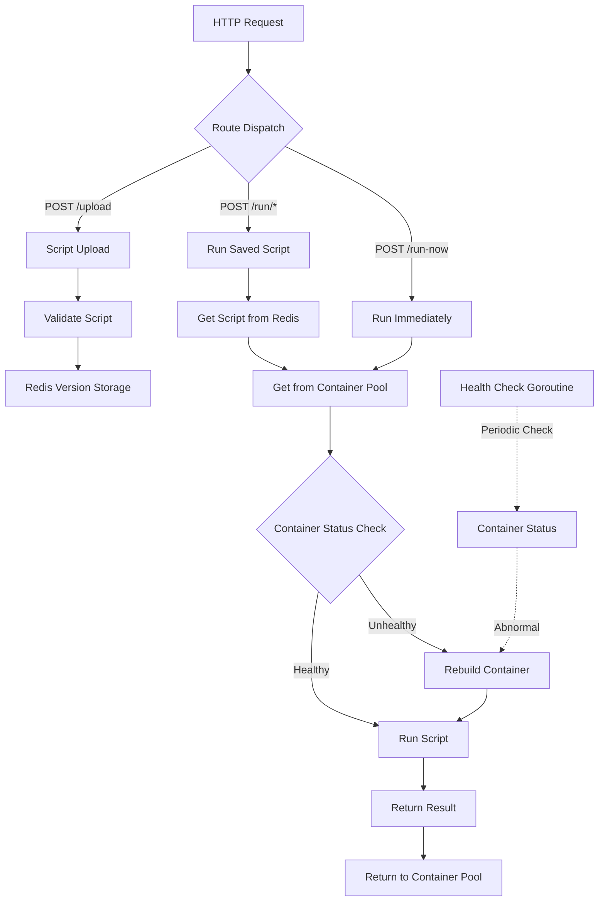

> [!NOTE]
> This README was translated by ChatGPT 4.1, get the original version from [here](./README.zh.md).


> [!TIP]
> Next step for the project: remove Podman dependency and switch to native sandboxing (such as seccomp, chroot, namespace, resource limits, etc.) for script isolation, simplifying deployment and improving performance.

# Go FaaS

[](https://pkg.go.dev/github.com/pardnchiu/go-faas)
[](https://goreportcard.com/report/github.com/pardnchiu/go-faas)
[](https://github.com/pardnchiu/go-faas/releases)
[](LICENSE)

> Lightweight Golang FaaS platform providing isolated execution environments for JavaScript, TypeScript, and Python scripts. Supports real-time execution and version management, using Podman containers to protect host security.

- [Core Features](#core-features)
  - [Multi-language Support](#multi-language-support)
  - [Container Isolation](#container-isolation)
  - [Smart Management](#smart-management)
- [System Architecture](#system-architecture)
- [Dependencies](#dependencies)
- [Requirements](#requirements)
- [Usage](#usage)
  - [Installation](#installation)
  - [Start Service](#start-service)
  - [Container Configuration](#container-configuration)
- [API](#api)
  - [Upload Script](#upload-script)
  - [Run Uploaded Script](#run-uploaded-script)
  - [Run Script Directly](#run-script-directly)
  - [Stream Execution (SSE)](#stream-execution-sse)
- [Script Types](#script-types)
  - [JavaScript](#javascript)
  - [TypeScript](#typescript)
  - [Python](#python)
- [License](#license)
- [Author](#author)
- [Star](#star)

## Core Features

### Multi-language Support
Supports execution of JavaScript, TypeScript, and Python scripts, with unified JSON format for parameter passing and result return.

### Container Isolation
Uses Podman container pool to isolate execution environments, protecting the host system. Each request runs in an independent container to avoid interference.

### Smart Management
Automatically detects container health and rebuilds unhealthy containers. Dynamic container pool management and auto-release mechanism ensure high availability.

## System Architecture



## Dependencies

- [`github.com/gin-gonic/gin`](https://github.com/gin-gonic/gin)
- [`github.com/redis/go-redis/v9`](https://github.com/redis/go-redis)
- [`github.com/joho/godotenv`](https://github.com/joho/godotenv)

## Requirements

- Go 1.23.0+
- Podman
- Redis 6.0+

## Usage

### Installation

```bash
# Clone the project
git clone https://github.com/pardnchiu/go-faas.git
cd go-faas

# Install dependencies
go mod download
```

### Start Service

```bash
# Start Redis (required)
podman run -d --name redis -p 6379:6379 redis:alpine

# Start service
go run cmd/api/main.go
```

### Container Configuration

```env
# default runtime.NumCPU() * 2
MAX_CONTAINERS=4
# default 0.25
MAX_CPUS_PER_CONTAINER=
# default 128 << 20 (128MB)
MAX_MEMORY_PER_CONTAINER=
# default false, set to true if Nvidia GPU is available
GPU_ENABLED=
# default 8080
HTTP_PORT=
# default 256 << 10 (256KB)
CODE_MAX_SIZE=
# default 30 (s)
TIMEOUT_SCRIPT=

# default localhost
REDIS_HOST=
# default 6379
REDIS_PORT=
# default no password
REDIS_PASSWORD=
# default 0
REDIS_DB=
```

## API

### Upload Script

- POST: `/upload` 
- Supported languages: 
  - `javascript`
  - `typescript`
  - `python`
- Request example
  ```json
  {
    "path": "test/calculator",
    "language": "javascript",
    "code": "return JSON.stringify({ sum: event.a + event.b });"
  }
  ```
- Response example
  ```json
  {
    "path": "test/calculator",
    "language": "javascript",
    "version": 1735286400000
  }
  ```

### Run Uploaded Script
- POST: `/run/{path}`
- Parameters
  - `version` (optional): Specify script version timestamp, default is latest version
- Request example
  ```json
  // Example for `/run/test/calculator`
  {
    "input": {
      "a": 10,
      "b": 5
    }
  }
  ```
- Response example
  ```json
  {
    "data": {
      "sum": 15
    },
    "type": "json"
  }
  ```

### Run Script Directly
- POST: `/run-now`
- Request example

  ```json
  {
    "language": "python",
    "code": "import json\nresult = {'sum': event['a'] + event['b']}\nreturn json.dumps(result)",
    "input": "{\"a\": 10, \"b\": 5}"
  }
  ```
  Response example
  ```json
  {
    "data": {
      "sum": 15
    },
    "type": "json"
  }
  ```

### Stream Execution (SSE)

- POST: `/run-now`
- Supported languages: `javascript`, `typescript`, `python`
- Purpose: Used for tracking log output, with responses in SSE format.
- To enable streaming, set `"stream": true` in the request body.
- Request example
  ```json
  {
    "language": "python",
    "code": "import json\nfor i in range(3):\n  print(json.dumps({'progress': i*50}))\nresult = {'sum': event['a'] + event['b']}\nprint(json.dumps({'sum': result['sum'], 'done': True}))",
    "input": "{\"a\": 10, \"b\": 5}",
    "stream": true
  }
  ```
- Response example (SSE)
  ```text
  data: {"event":"log","data":"Progress: 0%","type":"text"}

  data: {"event":"log","data":"Progress: 10%","type":"text"}

  data: {"event":"log","data":"Progress: 20%","type":"text"}

  data: {"event":"log","data":"Progress: 30%","type":"text"}

  data: {"event":"log","data":"Progress: 40%","type":"text"}

  data: {"event":"log","data":"Progress: 50%","type":"text"}

  data: {"event":"log","data":"Progress: 60%","type":"text"}

  data: {"event":"log","data":"Progress: 70%","type":"text"}

  data: {"event":"log","data":"Progress: 80%","type":"text"}

  data: {"event":"log","data":"Progress: 90%","type":"text"}

  data: {"event":"result","data":"Complete","type":"string"}
  ```

> [!NOTE]
> The stream API pushes data multiple times according to script progress, with the last message usually containing `event: result` to indicate completion.

## Script Types

> [!NOTE]
> All scripts receive input data via the `event` variable

### JavaScript

```javascript
// Input is provided via the event variable
const result = {
  sum: event.a + event.b,
  product: event.a * event.b
};
return result;
```

### TypeScript

```typescript
interface Event {
  a: number;
  b: number;
}

const result = {
  sum: event.a + event.b,
  product: event.a * event.b
};
return result;
```

### Python

```python
import json

result = {
  'sum': event['a'] + event['b'],
  'product': event['a'] * event['b']
}
return result
```

## Configuration

Timeout
- Script execution: 30 seconds (default)

Code limits
- max `256KB` (default)

## License

This project is licensed under [MIT](LICENSE).

## Author


<h4 style="padding-top: 0">邱敬幃 Pardn Chiu</h4>

<a href="mailto:dev@pardn.io" target="_blank">

</a>
<a href="https://linkedin.com/in/pardnchiu" target="_blank">

</a>

## Star

[](https://www.star-history.com/#pardnchiu/go-faas&Date)

***

©️ 2025 [邱敬幃 Pardn Chiu](https://pardn.io)
