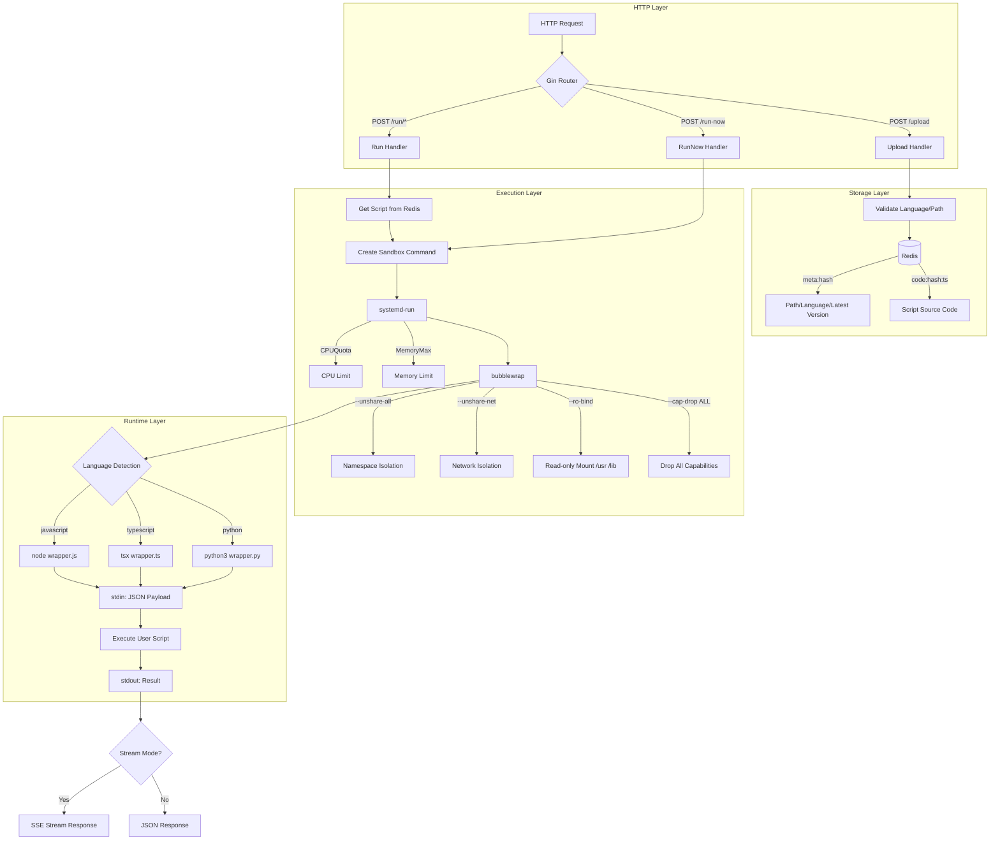

> [!NOTE]
> This README was generated by [Claude Code](https://github.com/pardnchiu/skill-readme-generate), get the ZH version from [here](./README.zh.md).


# go-faas

[](https://pkg.go.dev/github.com/pardnchiu/go-faas)
[](https://goreportcard.com/report/github.com/pardnchiu/go-faas)
[](https://github.com/pardnchiu/go-faas/releases)
[](LICENSE)

> Lightweight Golang FaaS platform providing isolated execution environments for JavaScript, TypeScript, and Python scripts. Uses bubblewrap sandbox with systemd-run resource limits for secure script execution without containers.

## Table of Contents

- [Features](#features)
- [Architecture](#architecture)
- [Installation](#installation)
- [Usage](#usage)
- [API Reference](#api-reference)
- [Script Examples](#script-examples)
- [License](#license)
- [Author](#author)
- [Stars](#stars)

## Features

- **Multi-language Support**: Execute JavaScript, TypeScript, and Python scripts with unified JSON parameter passing and result return
- **Sandbox Isolation**: Uses bubblewrap (bwrap) with Linux namespaces to isolate execution environments and protect the host system
- **Resource Limits**: Control CPU and memory usage via systemd-run to prevent malicious scripts from exhausting system resources
- **Version Management**: Scripts are automatically versioned and stored in Redis; execute specific versions or use the latest
- **Streaming Output**: Support SSE streaming mode for real-time script execution progress and log output

## Architecture



## Installation

### Requirements

- Go 1.23.0+
- Redis 6.0+
- Linux (requires bubblewrap and systemd)
- Node.js 22+
- Python 3.10+

### System Dependencies

```bash
# Ubuntu / Debian
sudo apt update
sudo apt install -y bubblewrap redis-server nodejs npm python3

# Fedora / RHEL
sudo dnf install -y bubblewrap redis nodejs npm python3

# Arch Linux
sudo pacman -S bubblewrap redis nodejs npm python
```

### Setup

```bash
git clone https://github.com/pardnchiu/go-faas.git
cd go-faas

# Install Go dependencies
go mod download

# Install Node.js dependencies (esbuild for TypeScript compilation)
npm install

# Install tsx (TypeScript executor)
npm install -g tsx
```

### Start Service

```bash
# Ensure Redis is running

# Start FaaS service
go run cmd/api/main.go
```

### Environment Variables

| Variable | Default | Description |
|----------|---------|-------------|
| `HTTP_PORT` | `8080` | HTTP service port |
| `MAX_CPUS` | `1` | CPU quota per sandbox (100% = 1 core) |
| `MAX_MEMORY` | `128M` | Memory limit per sandbox |
| `CODE_MAX_SIZE` | `262144` | Maximum code size (bytes) |
| `TIMEOUT_SCRIPT` | `30` | Script execution timeout (seconds) |
| `REDIS_HOST` | `localhost` | Redis host |
| `REDIS_PORT` | `6379` | Redis port |
| `REDIS_PASSWORD` | empty | Redis password |
| `REDIS_DB` | `0` | Redis database number |

## Usage

### Execute Script Immediately

```bash
curl -X POST http://localhost:8080/run-now \
  -H "Content-Type: application/json" \
  -d '{
    "language": "javascript",
    "code": "return { sum: event.a + event.b };",
    "input": "{\"a\": 10, \"b\": 5}"
  }'
```

Response:

```json
{
  "data": { "sum": 15 },
  "type": "json"
}
```

### Upload and Execute Script

```bash
# Upload script
curl -X POST http://localhost:8080/upload \
  -H "Content-Type: application/json" \
  -d '{
    "path": "math/add",
    "language": "javascript",
    "code": "return { result: event.a + event.b };"
  }'

# Execute saved script
curl -X POST http://localhost:8080/run/math/add \
  -H "Content-Type: application/json" \
  -d '{ "input": { "a": 10, "b": 5 } }'
```

### Streaming Mode

```bash
curl -X POST http://localhost:8080/run-now \
  -H "Content-Type: application/json" \
  -d '{
    "language": "python",
    "code": "import json\nfor i in range(3):\n  print(json.dumps({\"progress\": i}))\nreturn {\"done\": True}",
    "input": "{}",
    "stream": true
  }'
```

## API Reference

### POST /upload

Upload and store a script in Redis.

**Request Body:**

| Field | Type | Required | Description |
|-------|------|----------|-------------|
| `path` | string | Yes | Script path identifier |
| `language` | string | Yes | `javascript`, `typescript`, or `python` |
| `code` | string | Yes | Script source code |

**Response:**

```json
{
  "path": "math/add",
  "language": "javascript",
  "version": 1735286400
}
```

### POST /run/{path}

Execute an uploaded script.

**Query Parameters:**

| Parameter | Description |
|-----------|-------------|
| `version` | Specify version timestamp (optional, defaults to latest) |

**Request Body:**

| Field | Type | Description |
|-------|------|-------------|
| `input` | object/string | Input data passed to the script |
| `stream` | boolean | Enable SSE streaming mode |

### POST /run-now

Execute a script immediately without storing.

**Request Body:**

| Field | Type | Required | Description |
|-------|------|----------|-------------|
| `language` | string | Yes | `javascript`, `typescript`, or `python` |
| `code` | string | Yes | Script source code |
| `input` | string | No | JSON formatted input data |
| `stream` | boolean | No | Enable SSE streaming mode |

## Script Examples

All scripts receive input data via the `event` variable.

### JavaScript

```javascript
const result = {
  sum: event.a + event.b,
  product: event.a * event.b
};
return result;
```

### TypeScript

```typescript
interface Event {
  a: number;
  b: number;
}

const result = {
  sum: event.a + event.b,
  product: event.a * event.b
};
return result;
```

### Python

```python
result = {
    'sum': event['a'] + event['b'],
    'product': event['a'] * event['b']
}
return result
```

## License

This project is licensed under [MIT](LICENSE).

## Author


<h4 style="padding-top: 0">邱敬幃 Pardn Chiu</h4>

<a href="mailto:dev@pardn.io" target="_blank">

</a> <a href="https://linkedin.com/in/pardnchiu" target="_blank">

</a>

## Stars

[](https://www.star-history.com/#pardnchiu/go-faas&Date)

***

©️ 2025 [邱敬幃 Pardn Chiu](https://linkedin.com/in/pardnchiu)
