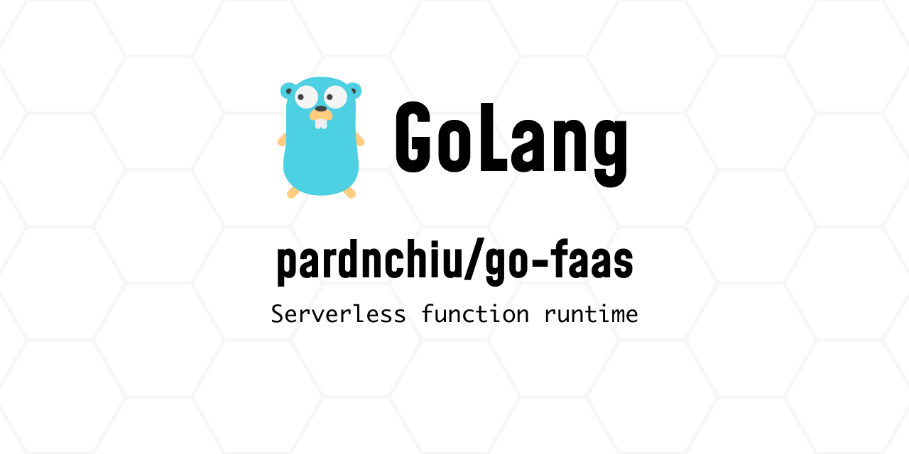
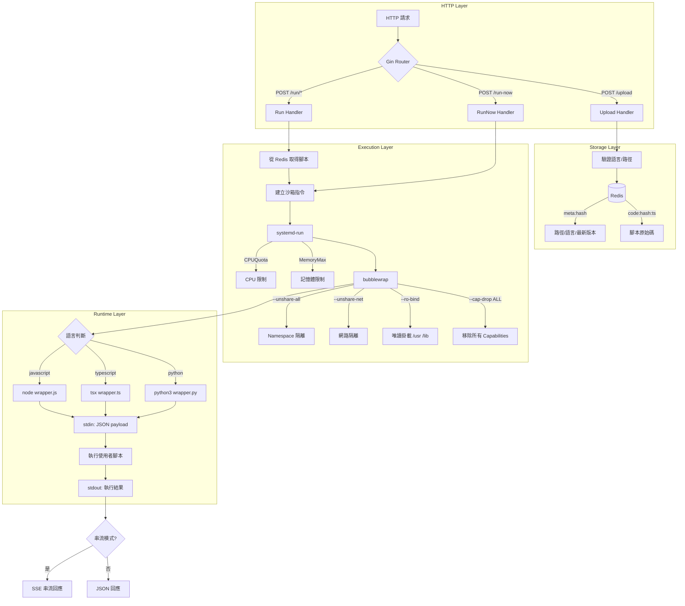

> [!NOTE]
> 此 README 由 [Claude Code](https://github.com/pardnchiu/skill-readme-generate) 生成，英文版請參閱 [這裡](./README.md)。



# go-faas

[](https://pkg.go.dev/github.com/pardnchiu/go-faas)
[](https://goreportcard.com/report/github.com/pardnchiu/go-faas)
[](https://github.com/pardnchiu/go-faas/releases)
[](LICENSE)

> 輕量的 Golang FaaS 平台，提供 JavaScript、TypeScript 與 Python 腳本的隔離執行環境。使用 bubblewrap 沙箱與 systemd-run 資源限制，無需容器即可安全執行使用者腳本。

## 目錄

- [功能特點](#功能特點)
- [系統架構](#系統架構)
- [安裝](#安裝)
- [使用方法](#使用方法)
- [API 參考](#api-參考)
- [腳本範例](#腳本範例)
- [授權](#授權)
- [Author](#author)
- [Stars](#stars)

## 功能特點

- **多語言支援**：支援 JavaScript、TypeScript 及 Python 腳本執行，透過統一的 JSON 格式進行參數傳遞與結果回傳
- **沙箱隔離**：使用 bubblewrap (bwrap) 搭配 Linux namespace 隔離執行環境，保護主機系統安全
- **資源限制**：透過 systemd-run 控制 CPU 與記憶體用量，防止惡意腳本耗盡系統資源
- **版本管理**：腳本上傳後自動版本化儲存於 Redis，可指定版本執行或使用最新版
- **串流輸出**：支援 SSE 串流模式，即時追蹤腳本執行進度與日誌輸出

## 系統架構



## 安裝

### 環境需求

- Go 1.23.0+
- Redis 6.0+
- Linux（需要 bubblewrap 與 systemd）
- Node.js 22+
- Python 3.10+

### 系統依賴安裝

```bash
# Ubuntu / Debian
sudo apt update
sudo apt install -y bubblewrap redis-server nodejs npm python3

# Fedora / RHEL
sudo dnf install -y bubblewrap redis nodejs npm python3

# Arch Linux
sudo pacman -S bubblewrap redis nodejs npm python
```

### 安裝步驟

```bash
git clone https://github.com/pardnchiu/go-faas.git
cd go-faas

# 安裝 Go 依賴
go mod download

# 安裝 Node.js 依賴（esbuild 用於 TypeScript 編譯）
npm install

# 安裝 tsx（TypeScript 執行器）
npm install -g tsx
```

### 啟動服務

```bash
# 確保 Redis 服務已啟動

# 啟動 FaaS 服務
go run cmd/api/main.go
```

### 環境變數

| 變數 | 預設值 | 說明 |
|------|--------|------|
| `HTTP_PORT` | `8080` | HTTP 服務埠 |
| `MAX_CPUS` | `1` | 每個沙箱 CPU 配額（100% = 1 core） |
| `MAX_MEMORY` | `128M` | 每個沙箱記憶體上限 |
| `CODE_MAX_SIZE` | `262144` | 程式碼最大尺寸（bytes） |
| `TIMEOUT_SCRIPT` | `30` | 腳本執行逾時（秒） |
| `REDIS_HOST` | `localhost` | Redis 主機 |
| `REDIS_PORT` | `6379` | Redis 埠 |
| `REDIS_PASSWORD` | 空 | Redis 密碼 |
| `REDIS_DB` | `0` | Redis 資料庫編號 |

## 使用方法

### 即時執行腳本

```bash
curl -X POST http://localhost:8080/run-now \
  -H "Content-Type: application/json" \
  -d '{
    "language": "javascript",
    "code": "return { sum: event.a + event.b };",
    "input": "{\"a\": 10, \"b\": 5}"
  }'
```

回應：

```json
{
  "data": { "sum": 15 },
  "type": "json"
}
```

### 上傳並執行腳本

```bash
# 上傳腳本
curl -X POST http://localhost:8080/upload \
  -H "Content-Type: application/json" \
  -d '{
    "path": "math/add",
    "language": "javascript",
    "code": "return { result: event.a + event.b };"
  }'

# 執行已儲存腳本
curl -X POST http://localhost:8080/run/math/add \
  -H "Content-Type: application/json" \
  -d '{ "input": { "a": 10, "b": 5 } }'
```

### 串流模式

```bash
curl -X POST http://localhost:8080/run-now \
  -H "Content-Type: application/json" \
  -d '{
    "language": "python",
    "code": "import json\nfor i in range(3):\n  print(json.dumps({\"progress\": i}))\nreturn {\"done\": True}",
    "input": "{}",
    "stream": true
  }'
```

## API 參考

### POST /upload

上傳腳本並儲存至 Redis。

**請求 Body：**

| 欄位 | 類型 | 必填 | 說明 |
|------|------|------|------|
| `path` | string | 是 | 腳本路徑識別碼 |
| `language` | string | 是 | `javascript`、`typescript` 或 `python` |
| `code` | string | 是 | 腳本原始碼 |

**回應：**

```json
{
  "path": "math/add",
  "language": "javascript",
  "version": 1735286400
}
```

### POST /run/{path}

執行已上傳的腳本。

**Query 參數：**

| 參數 | 說明 |
|------|------|
| `version` | 指定版本時間戳（選填，預設最新版） |

**請求 Body：**

| 欄位 | 類型 | 說明 |
|------|------|------|
| `input` | object/string | 傳遞給腳本的輸入資料 |
| `stream` | boolean | 啟用 SSE 串流模式 |

### POST /run-now

即時執行腳本，不儲存。

**請求 Body：**

| 欄位 | 類型 | 必填 | 說明 |
|------|------|------|------|
| `language` | string | 是 | `javascript`、`typescript` 或 `python` |
| `code` | string | 是 | 腳本原始碼 |
| `input` | string | 否 | JSON 格式輸入資料 |
| `stream` | boolean | 否 | 啟用 SSE 串流模式 |

## 腳本範例

所有腳本透過 `event` 變數接收輸入資料。

### JavaScript

```javascript
const result = {
  sum: event.a + event.b,
  product: event.a * event.b
};
return result;
```

### TypeScript

```typescript
interface Event {
  a: number;
  b: number;
}

const result = {
  sum: event.a + event.b,
  product: event.a * event.b
};
return result;
```

### Python

```python
result = {
    'sum': event['a'] + event['b'],
    'product': event['a'] * event['b']
}
return result
```

## 授權

此專案採用 [MIT](LICENSE) 授權條款。

## Author


<h4 style="padding-top: 0">邱敬幃 Pardn Chiu</h4>

<a href="mailto:dev@pardn.io" target="_blank">

</a> <a href="https://linkedin.com/in/pardnchiu" target="_blank">

</a>

## Stars

[](https://www.star-history.com/#pardnchiu/go-faas&Date)

***

©️ 2025 [邱敬幃 Pardn Chiu](https://linkedin.com/in/pardnchiu)
