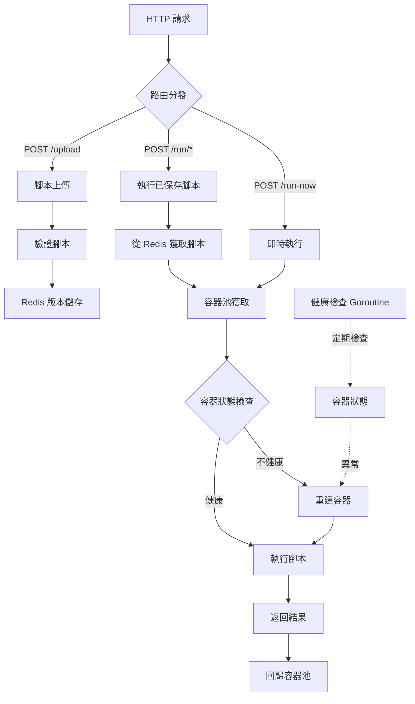

# Go FaaS

[](https://pkg.go.dev/github.com/pardnchiu/go-faas)
[](https://goreportcard.com/report/github.com/pardnchiu/go-faas)
[](https://github.com/pardnchiu/go-faas/releases)
[](LICENSE)

> 輕量的 Golang FaaS 平台，提供 JavaScript、TypeScript 與 Python 腳本的隔離執行環境，支援即時執行與版本管理，使用 Podman/Docker 容器保護主機安全

- [三大核心特色](#三大核心特色)
    - [多語言支援](#多語言支援)
    - [容器隔離](#容器隔離)
    - [智慧管理](#智慧管理)
- [系統架構](#系統架構)
- [依賴套件](#依賴套件)
- [環境需求](#環境需求)
- [使用方法](#使用方法)
    - [安裝](#安裝)
    - [啟動服務](#啟動服務)
    - [容器配置](#容器配置)
- [API](#api)
    - [上傳腳本](#上傳腳本)
    - [執行已上傳的腳本](#執行已上傳的腳本)
    - [直接執行腳本](#直接執行腳本)
- [腳本類型](#腳本類型)
    - [JavaScript](#javascript)
    - [TypeScript](#typescript)
    - [Python](#python)
- [配置說明](#配置說明)
- [授權條款](#授權條款)
- [作者](#作者)
- [星](#星)

## 三大核心特色

### 多語言支援
支援 JavaScript、TypeScript 和 Python 腳本執行，透過統一的 JSON 格式進行參數傳遞與結果回傳

### 容器隔離
使用 Podman 容器池隔離執行環境，保護主機系統安全，每個請求在獨立容器中執行，避免交叉干擾

### 智慧管理
自動檢測容器健康狀態並重建不健康容器，動態容器池管理與自動釋放機制，確保高可用性

## 系統架構



## 依賴套件

- [`github.com/gin-gonic/gin`](https://github.com/gin-gonic/gin)
- [`github.com/redis/go-redis/v9`](https://github.com/redis/go-redis)
- [`github.com/joho/godotenv`](https://github.com/joho/godotenv)

## 環境需求

- Go 1.23.0+
- Podman
- Redis 6.0+

## 使用方法

### 安裝

```bash
# Clone 專案
git clone https://github.com/pardnchiu/go-faas.git
cd go-faas

# 安裝依賴
go mod download
```

### 啟動服務

```bash
# 啟動 Redis (必須)
podman run -d --name redis -p 6379:6379 redis:alpine

# 啟動服務
go run cmd/api/main.go
```

### 容器配置

```env
MAX_CONTAINERS=4
GPU_ENABLED=false     # 若有 Nvidia GPU 可以配置
HTTP_PORT=8080

REDIS_HOST=localhost
REDIS_PORT=6379
REDIS_PASSWORD=
REDIS_DB=0
```

## API

### 上傳腳本

- POST: `/upload` 
- 支援語言: 
    - `javascript`
    - `typescript`
    - `python`
- 請求範例
    ```json
    {
      "path": "test/calculator",
      "language": "javascript",
      "code": "console.log(JSON.stringify({ sum: event.a + event.b }));"
    }
    ```
- 回應範例
    ```json
    {
      "path": "test/calculator",
      "language": "javascript",
      "version": 1735286400000
    }
    ```

### 執行已上傳的腳本
- POST: `/run/{path}`
- 參數
    - `version` (可選): 指定腳本版本時間戳，預設使用最新版本
- 請求範例
    ```json
    // 以 `/run/test/calculator` 為範例
    {
      "a": 10,
      "b": 5
    }
    ```
- 回應範例
    ```json
    {
      "sum": 15
    }
    ```

### 直接執行腳本
- POST: `/run-now`
- 請求範例
    ```json
    {
      "language": "python",
      "code": "import json\nresult = {'sum': event['a'] + event['b']}\nprint(json.dumps(result))",
      "input": "{\"a\": 10, \"b\": 5}"
    }
    ```
- 回應範例
    ```json
    {
      "output": {
        "sum": 15
      },
      "type": "json"
    }
    ```

## 腳本類型

> [!NOTE]
> 所有腳本透過 `event` 變數接收輸入資料

### JavaScript

```javascript
// 輸入透過 event 變數提供
const result = {
  sum: event.a + event.b,
  product: event.a * event.b
};
console.log(JSON.stringify(result));
```

### TypeScript

```typescript
interface Event {
  a: number;
  b: number;
}

const result = {
  sum: event.a + event.b,
  product: event.a * event.b
};
console.log(JSON.stringify(result));
```

### Python

```python
import json

result = {
    'sum': event['a'] + event['b'],
    'product': event['a'] * event['b']
}
print(json.dumps(result))
```

## 配置說明

超時
- 腳本執行: 30 秒

請求限制
- `/run/*`: 最大 10 MB
- `/run-now`: 最大 5 MB

## 授權條款

此專案採用 [MIT](LICENSE) 授權條款。

## 作者


<h4 style="padding-top: 0">邱敬幃 Pardn Chiu</h4>

<a href="mailto:dev@pardn.io" target="_blank">
  
</a> <a href="https://linkedin.com/in/pardnchiu" target="_blank">
  
</a>

## 星

[](https://www.star-history.com/#pardnchiu/go-faas&Date)

***

©️ 2025 [邱敬幃 Pardn Chiu](https://pardn.io)
