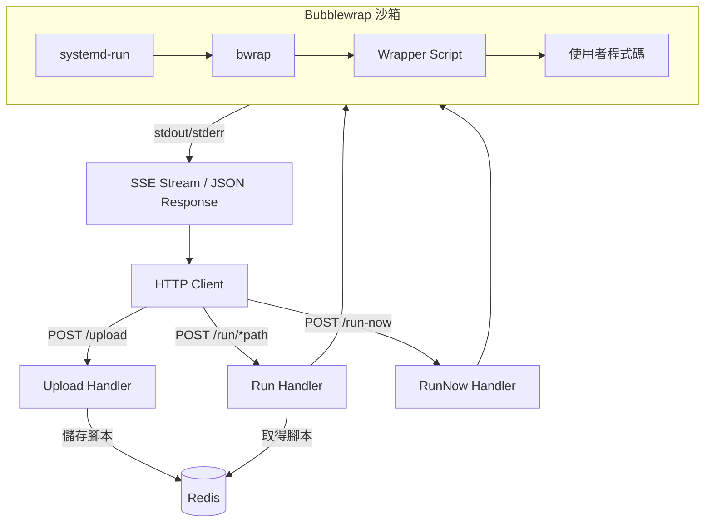

> [!NOTE]
> 此 README 由 [SKILL](https://github.com/pardnchiu/skill-readme-generate) 生成，英文版請參閱 [這裡](../README.md)。


# go-faas

[](https://pkg.go.dev/github.com/pardnchiu/go-faas)
[](https://goreportcard.com/report/github.com/pardnchiu/go-faas)
[](LICENSE)
[](https://github.com/pardnchiu/go-faas/releases)

> 輕量級 Function-as-a-Service 平台，透過 HTTP API 接收程式碼並在 Bubblewrap 沙箱中安全執行。

## 目錄

- [功能特點](#功能特點)
- [架構](#架構)
- [檔案結構](#檔案結構)
- [授權](#授權)
- [Author](#author)
- [Stars](#stars)

## 功能特點

> `go install github.com/pardnchiu/go-faas/cmd/api@latest` · [完整文件](./doc.zh.md)

### Bubblewrap 沙箱隔離

所有使用者提交的程式碼皆在 Bubblewrap 沙箱中執行，透過 Linux Namespace 隔離檔案系統、網路與行程空間，並移除全部 Capability。沙箱內僅掛載唯讀的系統路徑與 Wrapper 腳本，確保使用者程式碼無法存取主機資源或對外連線。

### 多語言即時執行與版本管理

支援 Python、JavaScript、TypeScript 三種語言的程式碼提交與執行。腳本透過 Redis 進行版本化儲存，每次上傳自動產生時間戳版本號，執行時可指定特定版本或自動取用最新版本，實現函式的持續迭代與回溯。

### Systemd Slice 資源管控

每個沙箱行程由 systemd-run 啟動並歸屬至自訂的 systemd slice，強制限制 CPU 配額與記憶體上限。當腳本超出資源限制時由系統層級直接終止，避免單一執行影響整體服務穩定性。

## 架構



## 檔案結構

```
go-faas/
├── cmd/
│   └── api/
│       └── main.go              # 進入點
├── internal/
│   ├── router.go                # HTTP 路由定義
│   ├── checker/
│   │   └── checker.go           # 相依套件檢查與自動安裝
│   ├── database/
│   │   └── redis.go             # Redis 腳本儲存與版本管理
│   ├── handler/
│   │   ├── run.go               # 程式碼執行 Handler
│   │   ├── upload.go            # 腳本上傳 Handler
│   │   └── sse.go               # SSE 串流輸出
│   ├── sandbox/
│   │   ├── command.go           # Bubblewrap 沙箱指令建構
│   │   └── slice.go             # Systemd Slice 資源限制
│   ├── resource/
│   │   ├── wrapper.py           # Python Wrapper
│   │   ├── wrapper.js           # JavaScript Wrapper
│   │   └── wrapper.ts           # TypeScript Wrapper
│   └── utils/
│       └── getEnv.go            # 環境變數輔助函式
├── .env.example
├── go.mod
└── LICENSE
```

## 授權

本專案採用 [MIT LICENSE](LICENSE)。

## Author


<h4 style="padding-top: 0">邱敬幃 Pardn Chiu</h4>

<a href="mailto:dev@pardn.io" target="_blank">

</a> <a href="https://linkedin.com/in/pardnchiu" target="_blank">

</a>

## Stars

[](https://www.star-history.com/#pardnchiu/go-faas&Date)

***

©️ 2025 [邱敬幃 Pardn Chiu](https://linkedin.com/in/pardnchiu)
